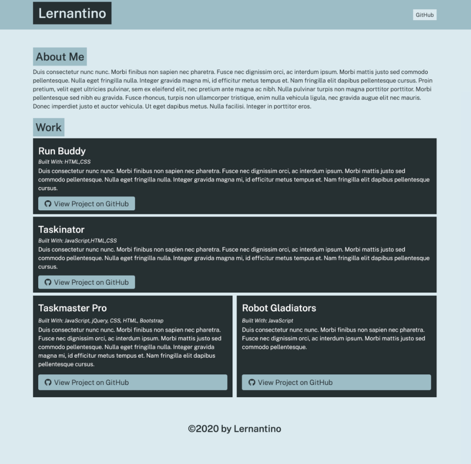

# portfolio-generator

## About 
This project utilizes the Node.js package thru the back-end command line terminal to allow the user to generate an HTML portfolio webpage that displays a collection web development projects.

## How to install:
To utilize this project, you must git clone the project to your local computer and access the apps through your command line terminal. A functioning webpage will not be deployed due to the app not running from a browser. 

## Created with:
Node.js package and NPM through the use of the command line terminal

## Author
Created by the UofA Coding Bootcamp and deployed by Brandi Curley

## Link to webpage (not functioning, will error):
https://galacticnative.github.io/portfolio-generator/

## Example:
